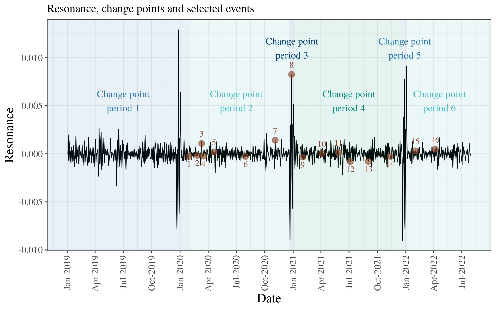

# Emotion dynamics on tweets during COVID19


## About Project
The aim for the project is to uncover dynamics on social media using emotion classification and applying relative entropy measures *novelty* and *resonance* to summarized probability distributions outputted by the model. The figure above shows the resonance signal from emotion classifications of 43 million Danish tweets between 2019-2022. 

### Classification models
This project contains script for using both emotion classifiers and topic modeling as the latent variable. The scripts can be used on both Danish and English texts. 

The Danish [BERT emotion](https://huggingface.co/DaNLP/da-bert-emotion-classification?text=Jeg+ejer+en+r%C3%B8d+bil+og+det+er+en+god+bil.) and [BERT tone](https://huggingface.co/DaNLP/da-bert-tone-sentiment-polarity?text=Det+er+super+godt) are used as emotion classifiers for Danish texts. [Distilbert-base-uncased-emotion](https://huggingface.co/bhadresh-savani/distilbert-base-uncased-emotion?text=you+look+stupid) is used as the emotion classifer for English texts. The [tweetopic](https://github.com/centre-for-humanities-computing/tweetopic) python package is used for fitting topic models for both languages.

### Change point detection
The search method Pruned Exact Linear Time (PELT) is used to identify the change points in the resonance signal. This method not only finds the relevant change points but also determines the number of change points. The radial basis function (rbf) are used as the cost function. The model is fitted using the [ruptures](https://centre-borelli.github.io/ruptures-docs/) python package.

## Project Organization
The organization of the project is as follows:

```
├── README.md                  <- The top-level README for this project.
├── fig                        
├── idmdl                      <- csv-files with novelty/transience/resonance
│   └── smoothed               <- csv-files with smoothed signal
├── logs                       
├── newsFluxus                 <- the repo newsFluxus from CHCAA github
├── notebooks                  <- notebooks for plotting      
│   ├── linear_models.ipynb
│   ├── vis_emotionFluxus.ipynb
│   └── ...
├── src                        <- main scripts
│   ├── tweets_bert.py
│   ├── tweets_topic.py
│   ├── summarize_models.py
│   ├── emotionFluxus.py
│   ├── smoothing.py
│   └── ...
├──  summarized_emo            <- ndjson-files with summarized scores of emotion distributions
├──  requirement.txt           <- A requirements file of the required packages.
└──  run.sh                    <- bash script for reproducing results
```

## Pipeline

| Do | File| Output placement |
|-----------|:------------|:--------|
Run classification | ```src/tweets_bert.py``` or ```src/topics_bert.py```  | ```../data/```
Summarize the emotion distributions | ```src/summarize_models.py``` | ```summarized_emo/```
Run newsFluxus pipeline | ```src/emotionsFluxus.py``` | ```idmdl/```
Smooth the signal | ```src/smoothing.py``` | ```idmdl/smoothed/```
Identify change points | ```src/changepoints.py``` | ```idmdl/changepoints/```

To see what input the different scripts need run ```-h``` (e.g. ```src/tweets_bert.py -h```).

Before running the code you must run the following to install requirements:
```
pip install -r requirements.txt
git clone https://github.com/centre-for-humanities-computing/newsFluxus.git
pip install -r newsFluxus/requirements.txt
```

## Reproduce results
To reproduce the results clone this repository and run the following command
```
bash run.sh
```

*NB: This only runs ```src/emotionFluxus.py``` and ```src/smoothing.py``` but not the rest of the pipeline, as the tweets used for this is not shared on git!* 

To visualize the results and run the linear models
- run ```notebooks/vis_emotionFluxus.ipynb``` to visualize the novelty and resonance signals
- run ```notebooks/linear_models.ipynb``` to fit and visualize the linear regressions between novelty and resonance

## Acknowledgments

Centre for Humanities Computing Aarhus for creating [newsFluxus](https://github.com/centre-for-humanities-computing/newsFluxus).