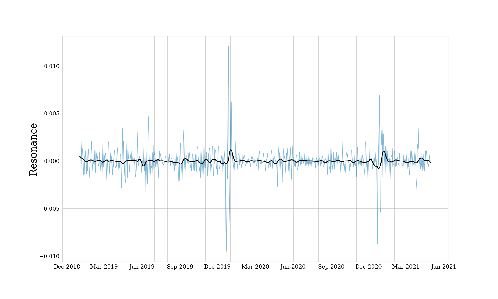

# Emotion dynamics on tweets during COVID19



## Abstract
Research  using  Twitter  data  has  become  increasingly  popular  in  the  last  few years.  This study investigates whether the temporal dynamics of Twitter can be characterized with windowed relative entropy measures using probability distributions based on the Danish BERT Emotion model as latent variables.  We find  that  this  method  does  seem  to  capture  changes  in  discourse  on  Twitter over time.  The validity of the method is supported by repeating the analysis using BERT Tone polarity distributions as latent variables.  Advantages of the approach are discussed along with possible limitations.  Hereafter, the signal is explored using linear models prediction resonance from novelty, and the influence of individual emotions is assessed using Pearson’s *r*.  The findings of this study lays the ground for future studies of dynamics of emotions on Twitter,and possible directions of this is considered.

## Project Organization
The organization of the project is as follows:

```
├── README.md                  <- The top-level README for this project.
├── fig                        
├── idmdl                      <- csv-files with novelty/transience/resonance
│   └── smoothed               <- csv-files with smoothed signal
├── logs                       
├── newsFluxus                 <- the repo newsFluxus from CHCAA github
├── notebooks                  <- notebooks for plotting      
│   ├── linear_models.ipynb
│   ├── vis_emotionFluxus.ipynb
│   └── ...
├── src                        <- main scripts
│   ├── tweets_bert.py
│   ├── summarize_models.py
│   ├── emotionFluxus.py
│   └── ...
├──  summarized_emo            <- ndjson-files with summarized scores of emotion distributions
├──  requirement.txt           <- A requirements file of the required packages.
└──  run.sh                    <- bash script for reproducing results
```

## Pipeline

| Do | File| Output placement |
|-----------|:------------|:--------|
Run BERT models | ```src/tweets_bert.py```  | ```../data/```
Summarize the emotion distributions | ```src/summarize_models.py``` | ```summarized_emo/```
Run newsFluxus pipeline | ```src/emotionsFluxus.py``` | ```idmdl/```
Smooth the signal | ```src/smoothing.py``` | ```idmdl/smoothed/```

To see what input the different scripts need run ```-h``` (e.g. ```src/tweets_bert.py -h```).

## Run the code
To reproduce the results clone this repository and run the following command
```
bash run.sh
```

*NB: This only runs ```src/emotionFluxus.py``` and ```src/smoothing.py``` but not the rest of the pipeline, as the tweets used for this is not shared on git!* 

To visualize the results and run the linear models
- run ```notebooks/vis_emotionFluxus.ipynb``` to visualize the novelty and resonance signals
- run ```notebooks/linear_models.ipynb``` to fit and visualize the linear regressions between novelty and resonance

## Acknowledgments

Centre for Humanities Computing Aarhus for creating [newsFluxus](https://github.com/centre-for-humanities-computing/newsFluxus).